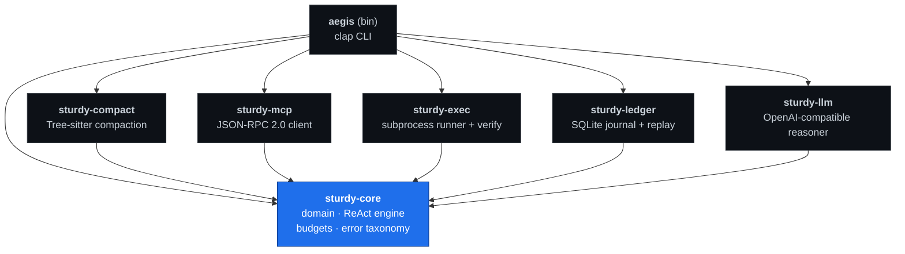
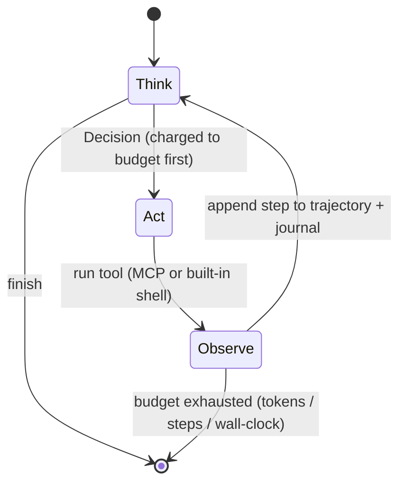

# Aegis

[](https://github.com/SturdyRobot/aegis/actions/workflows/ci.yml)
[](LICENSE)
[](https://sturdyrobot.io)

> **Run the engine in your browser** → **[sturdyrobot.io](https://sturdyrobot.io)** (open the 🦀 Aegis icon)
> The real ReAct engine compiled to WebAssembly — deterministic Think → Act → Observe,
> executing entirely client-side. No server, no API key, no network.

A deterministic AI-agent execution and verification harness, written in Rust.

Aegis sits between an LLM (frontier API or local Ollama) and a real
codebase. It drives a **ReAct** agent loop under **hard, enforceable budgets**,
manages the context window with **AST-aware compaction**, runs tools over the
**Model Context Protocol**, executes verification in **isolated subprocesses**,
and journals every step to **SQLite** for deterministic replay.

The design goal is *control*: an agent should never run away — not on tokens,
not on steps, not on wall-clock, and not on a build that forks a runaway child
process. Every one of those is a hard ceiling here.

```
$ aegis run "assess the toolchain"
▶ run 4b7ef49c-…
  goal: assess the toolchain

  [0] 🧠 Establish the toolchain before touching the project.
      → shell {"args":["--version"],"cmd":"cargo"}
      ← cargo 1.95.0 (…)
  [1] 🧠 Confirm the compiler is present too.
      → shell {"args":["--version"],"cmd":"rustc"}
      ← rustc 1.95.0 (…)
  [2] 🧠 Toolchain verified; nothing else to do for this demo goal.
      ⏹ finish: Toolchain verified.

✔ finished: Toolchain verified.
  3 steps · 54 tokens
  replay with: aegis replay 4b7ef49c-… --db aegis.sqlite
```

(That's the offline demo policy. Add `--model` to drive a real LLM — see below.)

## Capabilities

Aegis is a small workspace of composable crates, each a clean trait implementation:

- **Deterministic ReAct core** — hard token/step/wall-clock budgets, a validated
  state machine, and byte-for-byte replay from an append-only SQLite journal.
- **Shadow-Guard audit mode** (`aegis run --audit`) — a **zero-risk dry-run**: read
  tools execute for real so the agent reasons on real data, but every *mutating*
  tool is intercepted (nothing is written/called) and journaled. `aegis audit`
  then prints a security scorecard + a measured token/cost report.
- **Human-in-the-loop** (`aegis run --hitl`) — the same interception boundary, but
  it *pauses* on each mutating tool and asks a human to approve (`y/N`) before it
  runs; every decision is journaled. Three modes, one boundary: dry-run / approve /
  block (`aegis-policy`).
- **Crash recovery** (`aegis resume`) — continue an interrupted run from its last
  journaled step without re-executing already-performed (side-effecting) actions.
- **Bounded subagent mesh** (`aegis-mesh`) — spawn subagents in isolated Tokio
  tasks under hard budgets; a panic/timeout/runaway is contained, never touching
  the parent.
- **MCP client** (`aegis-mcp`) — native async JSON-RPC 2.0 over **stdio and
  streamable HTTP**; auto-discovers and routes external tools.
- **Regression harness** (`aegis eval`) — compare a run against a baseline ledger
  (step/tool/token/drift metrics) with JUnit output and CI exit codes.
- **AST-aware compaction** + a safe **content-hashed cache** (`aegis-cache`) — keep
  code skeletons within a token budget; never re-parse an unchanged file.
- **Guardrails** — user-space policy (`aegis-policy`: blocked tools, PII redaction,
  budgets) and kernel-boundary supervision (`aegis-probe`: eBPF LSM, Linux).
- **OpenTelemetry** (`--features otel`) — export execution spans to
  Jaeger/Datadog/Honeycomb; off by default, zero cost otherwise.
- **Python bindings** (`aegis-bridge` → `pip install aegis-rt`) — call the AST
  compactor, tool classifier, policy matcher, and forensic audit from Python. A
  `maturin`-built abi3 wheel; a separate, workspace-excluded crate.
- **HTTP control API** (`aegis serve`, `aegis-server`/axum) — inspect runs
  (`GET /runs`, `/runs/{id}`) and **resolve HITL approvals remotely**
  (`GET /approvals`, `POST /approvals/{id}`), so a dashboard/Slack/web UI can drive
  Aegis instead of a terminal. Pairs with `aegis-hitl`'s `WebhookApprover` — HITL
  approvals come from a webhook + this API, not just stdin `y/N`.

## Install

**Prerequisites:** a recent stable [Rust toolchain](https://rustup.rs) and a C
compiler (`cc`/`clang` on macOS/Linux, MSVC on Windows) — the Tree-sitter
grammar and bundled SQLite build a little native code. No network is required at
runtime.

Install the `aegis` binary straight from GitHub:

```sh
cargo install --git https://github.com/SturdyRobot/aegis
```

Or clone and build from source:

```sh
git clone https://github.com/SturdyRobot/aegis
cd aegis
cargo install --path .        # installs `aegis` into ~/.cargo/bin
# or just: cargo build --release   → target/release/aegis
```

Then:

```sh
aegis --help
aegis run "assess the toolchain"
```

## Architecture

A Cargo workspace with strict separation of concerns. `sturdy-core` is the
dependency root (pure, no I/O); every satellite crate depends on it and converts
its own errors into the core taxonomy at the boundary.



| Crate | Responsibility |
|-------|----------------|
| **sturdy-core** | Domain model, the ReAct engine + validated state machine, hard budget enforcement (atomic + wall-clock), the shared error type. Pure and heavily tested. |
| **sturdy-compact** | Tree-sitter token compactor for **Rust, Python, JS, TS, Go**. Keeps code *skeletons* (signatures, doc comments) and elides function bodies to fit a context budget. |
| **sturdy-mcp** | A native async **JSON-RPC 2.0** client for MCP over newline-delimited stdio, with concurrent request de-multiplexing. Speaks `initialize` / `tools/list` / `tools/call`. |
| **sturdy-exec** | Tokio subprocess runner. Each child leads its own **process group**, so a timeout reaps the whole subtree (`killpg`). Auto-detects and runs the project's verifier (**cargo/go/npm/pytest**) with a cargo **diagnostic interceptor**. |
| **sturdy-ledger** | Append-only **SQLite** journal. Records each step live via the engine's observer hook and reconstructs any run byte-for-byte (`replay`). |
| **sturdy-llm** | A `Reasoner` over any **OpenAI-compatible** chat endpoint (OpenAI/Ollama/vLLM/LM Studio) that emits ReAct JSON parsed straight into the engine's `Action` type. |
| **aegis-mesh** | Bounded subagent supervision — spawn children in isolated Tokio tasks under hard token/step/wall-clock bounds; panics/timeouts/runaways are contained and journaled, never touching the parent. |
| **aegis-eval** | Event-sourced regression harness — profiles baseline vs candidate ledgers (step/tool/token/drift metrics), emits JUnit XML + CI exit codes. |
| **aegis-cache** | Content-hashed (`sha256`) cache of deterministic AST compaction — never LLM responses. Unchanged file → cached skeleton, no re-parse. |
| **aegis-policy** | Lightweight user-space guardrails from `aegis-policy.toml` (blocked tools, PII redaction, per-run budgets) — a native matcher, not OPA/Rego. |
| **aegis-audit** | Shadow-Guard dry-run interceptor + forensic report (intercepted mutations, measured token/cost). |
| **aegis-probe** | Kernel-boundary supervision via eBPF LSM (Linux); portable no-op fallback elsewhere. The eBPF object is a separate, workspace-excluded crate. |
| **aegis** (bin) | `clap` CLI wiring it all together. |

### The ReAct engine

The heart is a strict `Think → Act → Observe` cycle. An explicit `StateMachine`
rejects any transition outside the cycle, and the shared `BudgetTracker` is
**charged before any expensive work is done** — so exhaustion is detected
deterministically, and the engine always returns a full trajectory even when it
stops early.



Plugging in a real model is just implementing one trait:

```rust
#[async_trait]
pub trait Reasoner: Send + Sync {
    async fn next_action(&self, task: &Task, trajectory: &Trajectory) -> Result<Decision>;
}
```

`sturdy-llm` ships a `ChatReasoner` implementing this against any
OpenAI-compatible endpoint. With no `--model`, the CLI uses a deterministic demo
policy so the whole pipeline runs offline.

## Driving a real model

`--model` points the agent at any OpenAI-compatible chat endpoint — **Ollama,
OpenAI, vLLM, LM Studio, llama.cpp**:

```sh
# Local Ollama (default base URL), built-in shell tool:
aegis run "what version of cargo is installed?" --model llama3.1

# OpenAI (key read from an env var, never the command line):
OPENAI_API_KEY=sk-... \
  aegis run "summarize the crate layout" \
  --model gpt-4o-mini --api-base https://api.openai.com/v1 --api-key-env OPENAI_API_KEY

# Give the agent a real MCP server as its tool source:
aegis run "list the Rust files and read main.rs" \
  --model llama3.1 \
  --mcp "npx -y @modelcontextprotocol/server-filesystem ."
```

The model is prompted to emit a strict ReAct JSON object each turn; its reported
token usage is charged against the budget, and every step is journaled for
replay just like the demo path.

## CLI

```
aegis run <goal>          Drive an agent under budgets, journaling every step
        --model NAME         LLM to drive the agent (omit → offline demo policy)
        --api-base URL       OpenAI-compatible base URL (default: local Ollama)
        --api-key-env VAR    read the API key from this env var
        --mcp "CMD ARGS"     launch an MCP server as the tool source
        --max-tokens N       token ceiling (default 100k)
        --max-steps N        step ceiling (default 12)
        --max-secs N         wall-clock ceiling (default 120)
        --db <path>          SQLite ledger (default aegis.sqlite)
        --config <path>      load defaults from a TOML file
        --json               emit the result as JSON

aegis compact <file> [--lang L] [--json]   AST compaction (rust/python/js/ts/go)
aegis verify [dir]              [--json]   build/test — cargo/go/npm/pytest (auto-detected)
aegis replay <id>               [--json]   reconstruct a past run from the ledger
aegis ledger list               [--json]   list every recorded run
aegis ledger show <id>          [--json]   one run's metadata, stats & full trajectory

aegis run … --audit                        shadow dry-run: read tools run for real,
                                            mutating tools are intercepted + journaled
aegis run … --hitl                         human-in-the-loop: pause + ask (y/N) before
                                            each mutating tool runs (decisions journaled)
aegis serve [--db] [--addr]                HTTP control API: GET /runs, /runs/<id>,
                                            /approvals · POST /approvals/<id>
aegis audit --ledger <db>                  forensic report: intercepted mutations +
        --price-per-1k <USD>                measured token/cost (cost only from your
        --runs-per-day <N>                  explicit price/volume inputs)
aegis resume <id> [--force]                resume a crashed/interrupted run from its
                                            last journaled step (no re-execution)
aegis eval  --suite <s> --candidate <db>   regression-test a run vs a baseline suite
        --output-format <json|junit|pretty>  (exit 1 on regression; JUnit for CI)
```

`Ctrl-C` during a run finalizes the ledger and prints the partial trajectory
(completed steps are journaled as they happen). Every command supports `--json`
for scripting/CI, and piping into `head`/`less` is safe.

### Configuration

`run` reads defaults from `./aegis.toml` (or `--config <path>`). Flags override
the file, which overrides the built-in defaults:

```toml
model      = "llama3.1"
api_base   = "http://localhost:11434/v1"
mcp        = "npx -y @modelcontextprotocol/server-filesystem ."
max_steps  = 20
max_tokens = 200000
db         = "runs.sqlite"
```

## Build & test

```sh
cargo build            # workspace + `aegis` binary
cargo test --workspace # 43 tests (incl. end-to-end CLI tests), all green
```

Requires a Rust toolchain and a C compiler (Tree-sitter grammars and bundled
SQLite build native code). No network is needed to build or to run the demo path.

## AI-Native development

This is a Rust codebase built with an **AI-native workflow**: I drive an AI coding
agent as a pair programmer and own the architecture, the design decisions, and the
final review. AI is a tool in the loop, not the author of record — the value is
that one developer can direct it to ship and *maintain* a system this broad without
the quality bar dropping. Concretely, where it was used:

- **Design & scaffolding.** I set the crate boundaries and the core contracts (the
  `Reasoner` trait, the budget model, the error taxonomy); the agent scaffolds
  implementations against them, and I review, refactor, and reject.
- **Adversarial self-audit.** After each subsystem landed, the agent was tasked to
  *attack its own code*. That surfaced real defects a happy-path pass would miss —
  an output-drain deadlock when a backgrounded child holds the pipe, a non-Unix
  timeout that never actually killed the child, an MCP reader/dispatch race, and
  a `verify` false-positive on non-cargo directories. Every one was fixed **with a
  regression test** so it can't silently return.
- **Test generation.** The suite (unit + end-to-end CLI tests via `assert_cmd`)
  was written agent-first from stated invariants, then pruned by hand.
- **CI as the backstop.** `cargo fmt`, `clippy -D warnings`, and the full test
  suite run on Linux and macOS on every push — the machine-written code has to pass
  the same gate as anything else.

The determinism goals of the tool itself (hard budgets, byte-identical replay)
are also what make an AI-native workflow trustworthy here: every run is journaled
and reproducible, so a change's effect is verifiable rather than vibes.

## Status

Every subsystem has a real, tested implementation. `aegis run` drives a live
model through real MCP (or built-in) tools under hard budgets, journaling each
step for deterministic replay; `compact` handles five languages; `verify`
auto-detects the project's build/test system; every command has `--json` output
and a `aegis.toml`-configurable, pipe-safe CLI covered by end-to-end tests.
A TUI and richer built-in tools are the remaining niceties.

## License

**[Business Source License 1.1](LICENSE)** (BUSL-1.1) — the same source-available
model used by HashiCorp, MariaDB, CockroachDB, and Sentry.

- **Free** to read, fork, modify, self-host, and use for any **non-commercial**
  purpose — personal projects, research, evaluation, and internal non-revenue use.
- **Commercial / enterprise use requires a paid license.** If Aegis (or a
  derivative or hosted version) is used in or as part of a for-profit product,
  service, or internal system, contact **noeljacksonjs@gmail.com** for a
  commercial license.
- On the **Change Date (2030-07-23)** each version converts to the **Apache
  License 2.0** and becomes fully open source.

